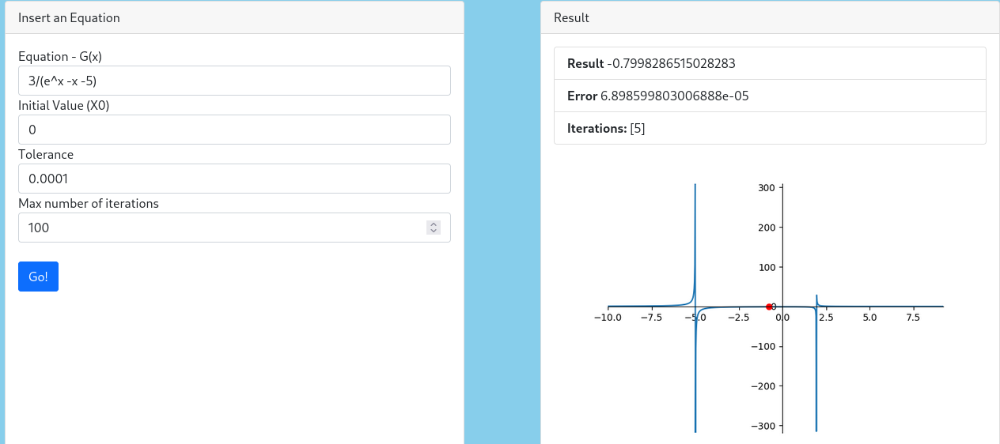

# ST0256-001-2021-2-Project

As a team, we have decided to work on developing an app that shows the implementation of different numeric methods, as proposed by the course programme, as well as the professor himself.  

# Table of contents
1. [Installation and configuration](#install_config)
   1. [Dependencies](#dep)
   2. [Running program](#run)
2. [Basic usage](#basic)
   1. [Non-linear equations](#nle)
   2. [Linear equations](#le)
   3. [Interpolation](#int)
   
# Installation and configuration  
## Dependencies 
For running the program succesfully, you need to install the needed dependencies:
`pip install -r requirements.txt`

## Running program 
In order to run the program:
`python src/run.py`

And then visit in your web browser the launched link:
`firefox http://127.0.0.1:5000/`

# Basic usage 
Once you're into the program, there will be a landing page where you can find the possible methods you can use for solving linear and non-linear equations, as well as interpolation problems

## Non-linear equations 
In non-linear section, you can solve problems through the following methods

### Valid functions
- exp
- log[^1]
- ln
- sin
- cos
- tan
- arctan
- arccos
- arcsin
- sqrt
- cosh
- sinh
- tanh

### Syntax
- Let's suppose we have the following function *2x² + 4*, then, the correct way to rewrite it is *2 * x^2 + 4*[^2]

[^1]: if you don't provide a base, it will be taken as ln
[^2]: note you must provide the multiplicator symbol

### Methods to find initial aproximation
This classification contains *incremental searches*.
Sample valid input for this method and its result

### Interval methods
This classification contains *bisection* and *fake rule*.
Sample valid input for both methods and its result (since both have the same input)

### Open methods
This classification contains *fixed point*, *Newton*, *secant*, and *multiple roots*. 
Sample valid input for each method and its result.

**Fixed point**

**Newton**

**Secant**

**Multiple roots**

## Linear equations 
In linear section, you can solve problems through the following methods:

### Syntax
- A matrix: must be typed as {{1, 2, 3}, {4, 5, 6}, {1, 9, 2}}
- B vector:  must be typed as {{23}, {2}, {0}} (since its a column vector)

### Direct methods
This classification contains *Simple Gaussian Elimination*, *Gaussian Elimination with parcial and total pivoting*, *LU factorization with Simple Gaussian Elimination* and *Gaussian Elimination with parcial pivoting*.

Sample valid input for these methods and its result (since they have the same input).

### Iterative methods
This classification contains *Jacobi*, *Gauss Seidel* and *SOR*.

Sample valid input for these methods and its result (since they have the same input).

## Interpolation 
In non-linear section, you can solve problems through the following methods

### Syntax
- X vector: x values of each point written as {x1, x2, x3}
- Y vector: y values of each point written as {y1, y2, y3}

### Interpolation methods
This classification contains *Vandermonde*, *Divided Differences*, *Lagrange*, *Linear Splines*, *Quadratic Splines*

Sample valid input for these methods and its result (since they have the same input)

---
author:
- Adrián Alberto Gutiérrez Leal  
- Santiago Hidalgo Ocampo  
- Manuela Herrera López  
- Simón Flórez Silva  
---
